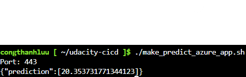

# Overview

* Udacity project

## Project Plan

* [Trello board](https://trello.com/invite/b/N3RLSxoj/ATTI4aa8df3d7b676269bb863900e9a09faa0D216143/project-management)
* [Spreadsheet](https://docs.google.com/spreadsheets/d/1zf5oqFOlVpnyKhosw4eyoodLz2KIBpbAsRtxc-96BdI/edit?usp=sharing)

## Instructions

* Architectural Diagram

Building step
* You need to clone your repo to CloudShell, then go to Deployment Center in Azure Webapp link your repo which contains the application

* Project running on Azure App Service

* Passing tests that are displayed after running the `make all` command from the `Makefile`

* Successful deploy of the project in Azure Pipelines.

* Successful prediction from deployed flask app in Azure Cloud Shell.

* Output of streamed log files from deployed application

* Successful deployment using Continuous Delivery on the Azure platform. 

* Successful running make all in CloudShell

## Enhancements

* Provide more GUI to the web application

## Demo 

[demo](https://youtu.be/KUDL4I8s4xo)

